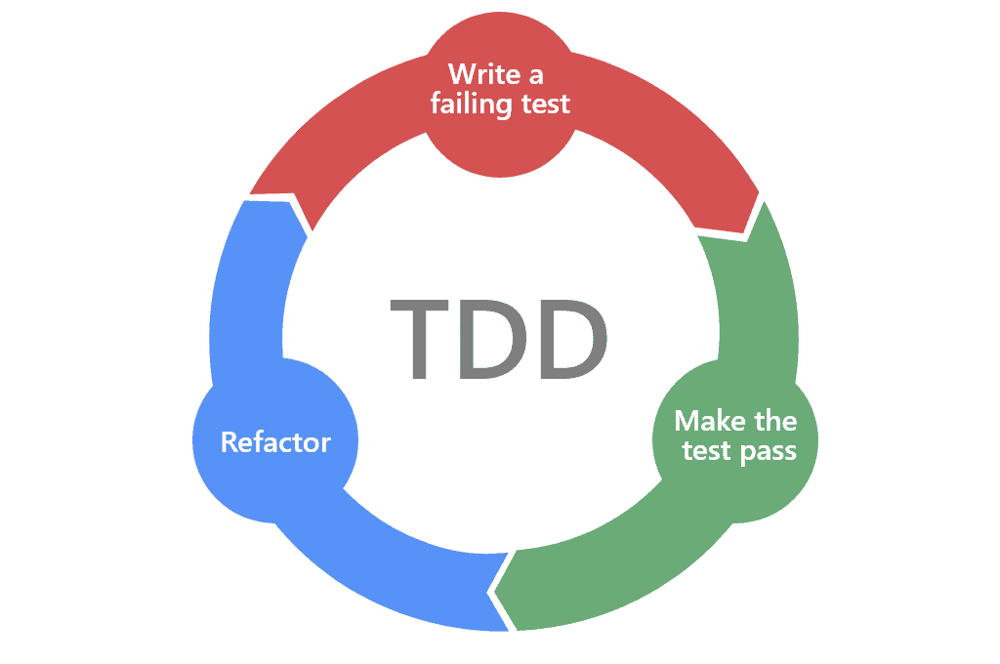

> #### Palindrome Of a Word Using TDD Approach
This project is about solving a simple problem Palindrome in different ways in Java using Test Driven Development.

> #### What is TDD

TDD is test driven development. It is a test first approach. As you see in the diagram below



This was introduced by Kent Beck who is one of the team members who created the Agile Manifesto. No doubt TDD is an Agile Development Methodology.

#### Steps followed in TDD

- You write the test first without writing a single piece of code.And of course if the test will fail as there is no code to check against.
- After that write just enough code to make the test pass.
- And lastly keep refactoring the code to meet the requirement.

This is a cycle and it goes on until all the test and the code are built to meet the project requirement.

> #### What is a palindrome of a word
A word that reads the same backwards as forwards

### Setup
- IntelliJ IDE
- Maven with JUnit Jupiter dependency

Maven dependency

```Java

        <dependency>
            <groupId>org.junit.jupiter</groupId>
            <artifactId>junit-jupiter</artifactId>
            <version>5.9.2</version>
        </dependency>
  

```
> #### Glimpse of the development

Before focussing on the palindrome the first test rather focussed if the word is actually valid and hence a test for NullPointerException is written.

```Java
 @Nested
    @DisplayName("Checking the validity of the word")
    class CheckingTheValidityOfTheWord {

    @Test
    @DisplayName("Checking whether the word is null")
    void checkingWhetherTheWordIsNull() {
        String input = null;
        NullPointerException e = Assertions.assertThrows(NullPointerException.class, () -> WordPalindrome.isWordValid(input), "No NullPointerException raised");
        assertEquals("Null values are not allowed", e.getMessage());
    }

  
}
```

Obviously since no code is written the test fails.

After that just enough code is written to make the test pass

```Java

public static boolean isWordValid(String word) throws NullPointerException {
  
            throw new NullPointerException("Null values are not allowed");
        }
       

```
And at last refactoring the code to meet the requirement.
```Java
 public static boolean isWordValid(String word) throws NullPointerException {
        boolean result=false;
        if (word == null) {
            throw new NullPointerException("Null values are not allowed");
        }
        return result;
    }
```
And this whole process was used to build up the whole project.

The palindrome was coded using 3 ways :-
- String
- StringBuilder
- Recursive Way

The testing to be more efficient the Junit params was used so that more values can be tested at a go as you can see below :-

```Java
@Nested
    @DisplayName("Checking a word is palindrome or not through using just Strings")
    class CheckingAWordIsPalindromeOrNotUsingJustStrings {

        @ParameterizedTest
        @DisplayName("Checking if a word is a palindrome")
        @ValueSource(strings = {"rotator", "motom", "MAdam", "pollop"})
        void checkingWhetherAWordIsAPalindrome(String input) {
            Assertions.assertTrue(WordPalindrome.isPalindromeJustStringWay(input));
        }

        @ParameterizedTest
        @DisplayName("Checking if a word is not a palindrome")
        @ValueSource(strings = {"Astha", "motor"})
        void checkingWhetherAWordIsNotAPalindrome(String input) {
            Assertions.assertFalse(WordPalindrome.isPalindromeJustStringWay(input));
        }

      }
```


The test coverage report for the project :-


As you can see the WordPalindrome Class had 100% methods tested which is a really good outcome becaus eof using TDD approach.


